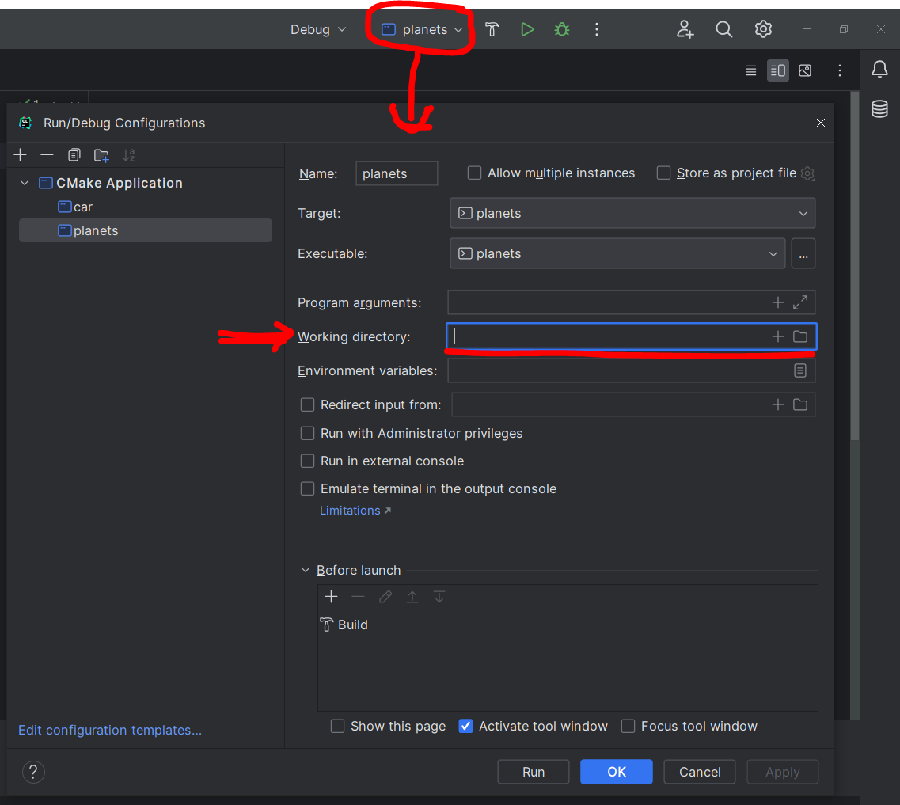
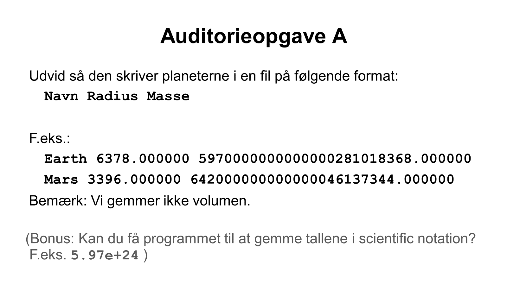
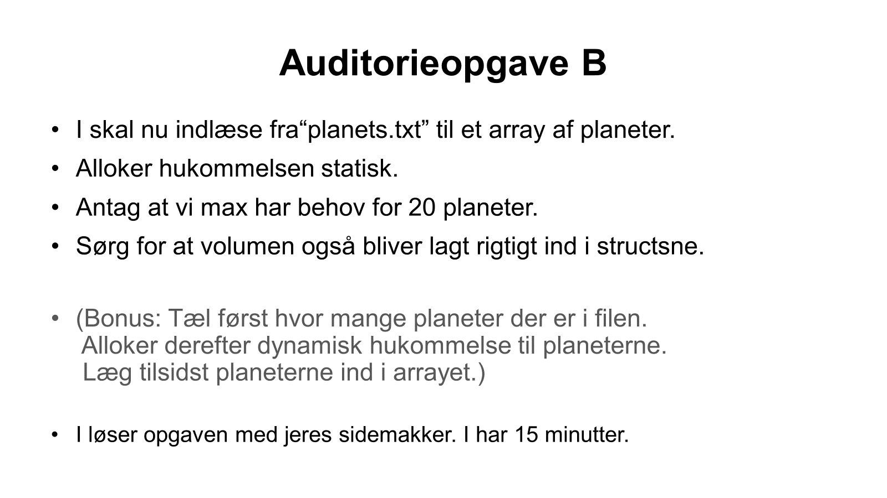

# IMPR-Lecture-12-live

I CLion kan du vælge 'working directory' for run configuration:

## Auditorieopgave A
Kan laves i [src/planets.c](src/planets.c).

---

## Auditorieopgave B
Kan også laves i [src/planets.c](src/planets.c). Læs fra filen [planets.txt](planets.txt).

