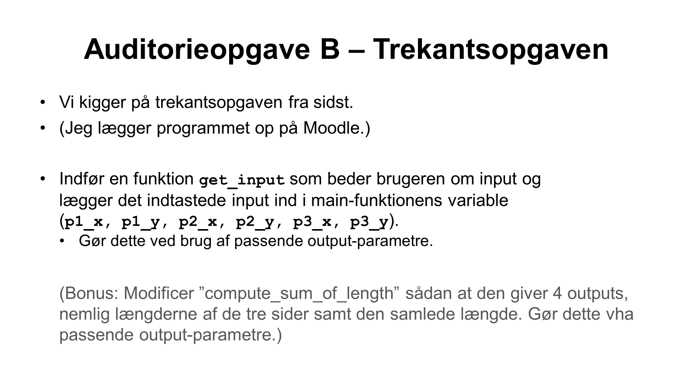

# IMPR-Lecture-6-live

Live-coding af 'græsplæneudvidelse' findes i [src/live.c](src/live.c).

### Auditorieopgave A - Vektor addition
I [src/vector.c](src/vector.c)

### Auditorieopgave B
Med udgangspunkt i [src/trekant.c](src/trekant.c)

